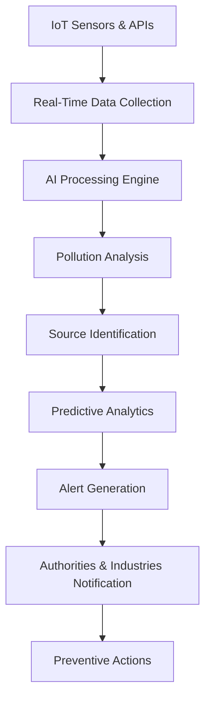

# 🌍 POLLU-SENSE — AI Powered Air Pollution Tracking System

<div align="center">


<br/>
<br/>

# 🌱 POLLU-SENSE

### *Smart AI System for Real-Time Air Pollution Tracking, Notification & Control*

### 🚀 Built By Team Green-Guardians

</div>

---

# 📌 Overview

POLLU-SENSE is an AI-powered real-time air pollution monitoring and control platform designed to tackle the growing environmental crisis caused by industrial emissions, vehicular pollution, construction dust, and harmful gases.

The system uses:

* 🤖 Artificial Intelligence
* 🌐 IoT Sensors
* 📡 Real-Time Data Monitoring
* 📊 Predictive Analytics
* 📍 Smart Mapping
* 📧 Automated Alerts

to monitor pollution levels, identify pollution sources, and instantly notify industries and authorities before the situation becomes critical.

---

# 🎯 Problem Statement

Air pollution is one of the biggest environmental and health challenges globally.

### Key Problems:

* ❌ Lack of real-time pollution tracking
* ❌ No proper identification of polluters
* ❌ Delayed action from industries & authorities
* ❌ Increasing respiratory and cardiovascular diseases
* ❌ Huge economic losses due to pollution-related health issues

---

# 💡 Our Solution

POLLU-SENSE introduces a smart AI-driven ecosystem capable of:

✅ Real-Time Air Quality Monitoring
✅ Pollution Source Detection
✅ Predictive AI Analysis
✅ Smart Notifications & Alerts
✅ Industry Compliance Monitoring
✅ Public Participation & Reporting
✅ Smart City Integration
✅ Automated Air Purification Activation

---

# 🧠 Core Features

| Feature                         | Description                         |
| ------------------------------- | ----------------------------------- |
| 🌍 Real-Time Monitoring         | Live AQI and pollution tracking     |
| 🤖 AI Prediction System         | Forecast future pollution spikes    |
| 📍 Pollution Source Detection   | Identify traffic, industries & dust |
| 📧 Smart Notifications          | Instant email/SMS alerts            |
| 🛰️ Satellite + IoT Integration | Accurate environmental monitoring   |
| 📊 Analytics Dashboard          | Historical pollution insights       |
| 🏭 Industry Compliance Tracking | Monitor industrial pollution        |
| 🧑‍🤝‍🧑 Crowdsourced Reporting | Citizens can report pollution       |
| 🌫️ Automated Air Purification  | Smart mist sprays & filters         |
| 🗺️ Google Maps Integration     | Pollution heatmap visualization     |

---

# 🛠️ Tech Stack

## Frontend

* ⚛️ React.js
* 🎨 Tailwind CSS
* 📈 Chart.js
* 🔥 Firebase Authentication

## Backend

* 🐍 Django
* ⚡ Flask API
* 🔌 WebSockets

## AI & ML

* 🤖 TensorFlow
* 📊 Scikit-Learn
* 🧠 Predictive Analytics

## Database

* 🐘 PostgreSQL

## APIs & Services

* 🌦️ OpenWeatherMap API
* 🗺️ Google Maps API
* 📡 CPCB Pollution Data API
* 🔔 Firebase Cloud Messaging

## Deployment

* 🚀 Render
* ☁️ Cloud Hosting

---

# 📷 Screenshots

## 🏠 Homepage

```md
Add homepage screenshot here
```

## 📊 Dashboard

```md
Add dashboard screenshot here
```

## 🗺️ Pollution Map

```md
Add maps screenshot here
```

## 📧 Alert System

```md
Add email alert screenshot here
```

---

# 🔄 System Workflow



---

# 📈 Impact

## 🌿 Environmental Impact

* Reduced pollution exposure
* Cleaner urban air
* Improved AQI monitoring

## ❤️ Health Benefits

* Lower respiratory diseases
* Better public health awareness
* Early pollution warnings

## 💰 Economic Impact

* Reduced healthcare costs
* Increased productivity
* Smart city sustainability

---

# 📊 Supporting Statistics

| Statistics                               | Data           |
| ---------------------------------------- | -------------- |
| 🌍 Premature deaths due to air pollution | 7 Million/year |
| 🇮🇳 Indian cities exceeding AQI limits  | 70%+           |
| 💸 India's annual economic loss          | $150 Billion   |
| 🚗 Vehicular pollution contribution      | 30%            |
| 🏗️ Construction dust contribution       | 20-30% PM2.5   |

---

# 🚀 Future Scope

* 🌐 Expansion to multiple smart cities
* 📱 Dedicated mobile application
* 🛰️ Satellite-based monitoring enhancement
* 🤖 Advanced AI forecasting models
* 🚦 Smart traffic pollution control
* 🔋 Renewable energy integration

---

# 🧪 Feasibility & Viability

✔️ Scalable Architecture
✔️ AI & IoT Integration Ready
✔️ Smart City Compatible
✔️ Government Adoption Potential
✔️ Economically Sustainable

---

# 🗺️ Roadmap

## Phase 1

* Sensor Integration
* Data Collection APIs

## Phase 2

* AI Model Training
* Pollution Forecasting

## Phase 3

* Frontend Dashboard Development
* Real-Time Maps Integration

## Phase 4

* Alert & Notification System

## Phase 5

* Deployment & Smart City Integration

---

# 👨‍💻 Team Green-Guardians

## 👤 Team Members

### 👨‍💻 Nirmal Todwal
### 👨‍💻 Sahil Bagga
### 👨‍💻 Sanjay Singh 
### 👨‍💻 Ronak Todwal

---

# 📬 Contact

📧 Email: [nirmaltodwal566@gmail.com](mailto:nirmaltodwal566@gmail.com)

---

# 🔗 References & Research

* WHO Air Pollution Reports
* CPCB India AQI Data
* OpenWeatherMap APIs
* Johns Hopkins Air Quality Forecasting Research
* Environment Protection Act 1986

---

# ⭐ Why POLLU-SENSE?

POLLU-SENSE is not just a monitoring platform — it is a complete intelligent ecosystem designed to create cleaner, healthier, and smarter cities using the power of Artificial Intelligence and IoT.

---

# 📌 GitHub Setup Instructions

## 1️⃣ Create Repository

Repository Name:

```bash
pollu-sense-ai
```

## 2️⃣ Upload Project Files

Upload:

* Frontend
* Backend
* README.md
* Screenshots

---

# 📥 Clone Repository

```bash
git clone https://github.com/your-username/pollu-sense-ai.git
```

---

# ▶️ Run Frontend

```bash
cd frontend
npm install
npm run dev
```

---

# ▶️ Run Backend

```bash
cd backend
pip install -r requirements.txt
python manage.py runserver
```

---

# 🤝 Contributing

Contributions are always welcome!

1. Fork the repository
2. Create a feature branch
3. Commit your changes
4. Push your branch
5. Open a Pull Request

---

# 📜 License

This project is licensed under the MIT License.

---

<div align="center">

# 🌍 Together We Can Build A Cleaner Future

### ⭐ Star This Repository If You Like The Project

</div>

---

Based on your uploaded project PPT: 
